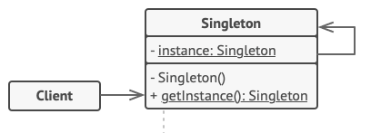

# Singleton :waning_gibbous_moon:

## 1. Introducción.

Utilizaremos el patrón Singleton cuando por alguna razón necesitemos que exista sólo una instancia (un objeto) de una determinada Clase. Muchas veces deseamos esto y mas alla de desearlo lo veremos obligatorio hacerlo, como por ejemplo alguna conexión a una base de datos. Cabe mencionar y es curioso, que a Singleton tambien se le conoce como un antipatrón, es decir que en vez de aportar soluciones buenas o positivas a nuestro software, este trae problemas, un mal uso de Singleton nos podria hacer caer en estas trampas.


## 1. Nombre del patrón.

Singleton.

## 2. Clasificación del patrón.

Creacional

## 3. Intención.

Singleton proporciona que se lleve a cabo solo una instanciación de una clase, es decir, solo existe un objeto de esta clase en el programa, 
mientras proporciona un punto de acceso global a esta instancia. Como en la imagén que observamos arriba.

## 4. También conocido como.

Singleton

## 5. Motivación.
Usamos Singleton cuando una clase en el programa debe tener solo una unica instancia disponible para todos los clientes; por ejemplo, un solo objeto en una base de datos el cual es compartido para diferentes partes del programa.

## 6. Aplicabilidad.

Otros usos comunes de este patrón es cuando necesitamos control estricto sobre variables globales.

Los criterios para aplicar este patrón son:

- Solo debe existir una única instancia de una clase y debe existir un acceso a esta.

- Cuando esta única instancia debe ser extendida por subclases y los clientes deben ser capaces de extender esta instancia sin la modificación de sus códigos.

## 7. Estructura.
El siguiente diagrama representa Singleton:



## 8. Participantes.

- Singleton: Esta es la clase que se encarga de si misma de crear la unica instancia que existira de la clase, y la que esconde la creación de esta en un metodo estatico, es decir un metodo propio de la clase y no del objeto

- Client: El cual necesita obtener el objeto de Singleton.


## 9. Colaboraciones.

Como se menciono en el apartado de **Participantes** , Singleton se encarga de crear su propia instancia, y en cuanto al cliente, el cliente obtiene el objeto de Singleton, solo por medio del metodo **getInstance()**, no lo podra hacer mediante un "new" por ejemplo, ya que el constructor de Singleton es privado, entonces no devolvera el objeto como suele ser si este (el constructor) es publico. El cliente solo obtendra una unica instancia, no sera posible crear otro, ya que Singleton no se lo permitira, a menos que se modifique el metodo que realiza esta acción y defina un numero de instancias a crear.

## 10. Consecuencias.


:white_check_mark: Estas seguro que una clase tiene una sola instancia.

:white_check_mark: Ganas un punto de acceso global a esa instancia.

:white_check_mark: El objeto Singleton es inicializado solo cuando es requerido por primera vez. 


:x: Viola el principio de Responsabilidad Unica. El patron resuelve dos problemas al tiempo.
 
:x: El patrón Singleton puede disfrazar un mal diseño, por ejemplo cuando los componentes del porgrama se conocen mucho entre si.

:x: El patrón requiere un tratamiento especial en un entorno multiproceso para que múltiples hilos no creen un objeto singleton varias veces.


## 11. Implementación.

La clase Singleton declara el metodo estatico **getInstance()** el cual retorna o devuelve la misma instancia de esta propia clase.
    
El constructor debe ser escondido del cliente. Llamando al metodo **getInstance()** debe ser la unica manera de obtener el objeto de la clase Singleton 

## 12. Código de ejemplo.
:one: Este es el codigo por parte de Singleton.
``` java
public final class Singleton {
    private static Singleton instance;
    public String value;

    private Singleton(String value) {
        // The following code emulates slow initialization.
        try {
            Thread.sleep(1000);
        } catch (InterruptedException ex) {
            ex.printStackTrace();
        }
        this.value = value;
    }

    public static Singleton getInstance(String value) {
        if (instance == null) {
            instance = new Singleton(value);
        }
        return instance;
    }
}
```
:two: Este es el codigo por parte del cliente:

``` java
public class DemoSingleThread {
    public static void main(String[] args) {
        System.out.println("If you see the same value, then singleton was reused (yay!)" + "\n" +
                "If you see different values, then 2 singletons were created (booo!!)" + "\n\n" +
                "RESULT:" + "\n");
        Singleton singleton = Singleton.getInstance("FOO");
        Singleton anotherSingleton = Singleton.getInstance("BAR");
        System.out.println(singleton.value);
        System.out.println(anotherSingleton.value);
    }
}
```
:three: Salida
```
If you see the same value, then singleton was reused (yay!)
If you see different values, then 2 singletons were created (booo!!)


RESULT:

FOO
FOO
```
## 13. Usos conocidos.

Muy usado en WidgetKits y en el manejo de Sesiones.

## 14. Patrones Relacionados.

- Abstract Factory, Builder y Prototype, todo pueden ser implementados como Singleton. 
- Una clase Facade se puede transformar en Singleton ya que un solo objeto fachada es suficiente en la mayoria de los casos.


# Referencias Bibliograficas

1. Design Pattern, Cretional Patterns, Singleton, REFACTORING -GURU-
https://refactoring.guru/design-patterns/singleton
2. Patrones Creacionales, Singleton, Daza Corredor Alejandro Paolo.
